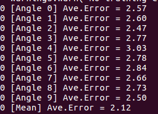
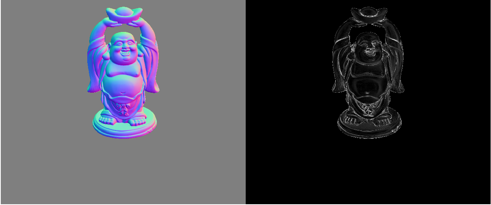

# CNN-PS

Satoshi Ikeahta. CNN-PS: CNN-based Photometric Stereo for General Non-Convex Surfaces, ECCV2018.

 [paper](https://arxiv.org/abs/1808.10093)

 [supplementary](webimage/cnnps_eccv2018-supp.pdf)

## Getting Started

This is a Keras implementation of a CNN for estimating surface normals from images captured under different illumination.

### Prerequisites

- Python3.5+
- Keras2.0+
- numpy
- OpenCV3

Tested on:
- Ubuntu 16.04, Python 3.5.2, Keras 2.0.3, Tensorflow(-gpu) 1.0.1, Theano 0.9.0, CUDA 8.0, cuDNN 5.0
  - CPU: Intel® Xeon(R) CPU E5-1650 v4 @ 3.60GHz × 12 , GPU: 3x GeForce GTX1080Ti, Memory 64GB

### Running the tests
For testing network (with DiLiGenT dataset), please download [DiLiGenT dataset (DiLiGenT.zip)](https://sites.google.com/site/photometricstereodata/) by Boxin Shi [1] and extract it anywhere. Then, specify the path of DiLiGenT/pmsData in test.py as

```
diligent = 'USER_PATH/DiLiGenT/pmsData'
```

The pretrained model for TensorFlow backend is included (weight_and_model.hdf5). You can simply try to run test.py as

```
python test.py
```

If the program properly works, you will get average angular errors (in degrees) for each dataset.



The final result [Mean] is the error about the averaged surface normal over normals predicted from K (K=10 in this case) differently rotated observation maps (See details in my paper). Finally, you will get the predicted surface normal map and the error map.



### Important notice about DiLiGenT datasets

As mentioned in the paper, I found that DiLiGenT dataset has some problems.
- The first 20 images in bearPNG are corrupted. To get the good result, "skip" first 20 images in the dataset by uncommenting this line in test.py.
```
# [Sv, Nv, Rv, IDv, Szv] = dio.prep_data_2d_from_images_test(dirlist, 1, w, 10, index = range(20, 96)) # for bearPNG
```

- normal.txt (ground truth surface normals) in harvestPNG is flipped upside down. To get the proper result, uncomment this line in mymodule/deeplearning_IO.py.

```
# nml = np.flipud(nml) # Uncomment when test on Harvest, the surface noraml needs to be flipped upside down
```
### Running the test on othter datasets (Unsupported)
If you want to run this code on ohter dataset, please allocate your own data just in the same manner with DiLiGenT. The required files are
- images (.png format in default, but you can easily change the code for other formats)
- lights (light_directions.txt, light_intensities.txt)
- normals (normal.txt, if no ground truth surface normal is available, you can simply set all the values by zero)

### Running the training
Training is NOT supported in this repository but you can download the training dataset from [here](https://www.dropbox.com/scl/fo/i7a53ym4s4ugwp3pmkj9s/ACJEww6wxoz8b0byacGMCys?rlkey=w70hp17oqe9dxpg1j60ogb6p1&st=ws4me2cc&dl=0)
## License

This project is licensed under the MIT License - see the [LICENSE.md](LICENSE.md) file for details

## Acknowledgments
This work was supported by JSPS KAKENHI Grant Number JP17H07324.

## References
[1] Boxin Shi, Zhipeng Mo, Zhe Wu, Dinglong Duan, Sai-Kit Yeung, and Ping Tan, "A Benchmark Dataset and Evaluation for Non-Lambertian and Uncalibrated Photometric Stereo", In IEEE Transactions on Pattern Analysis and Machine Intelligence (TPAMI), 2018.
